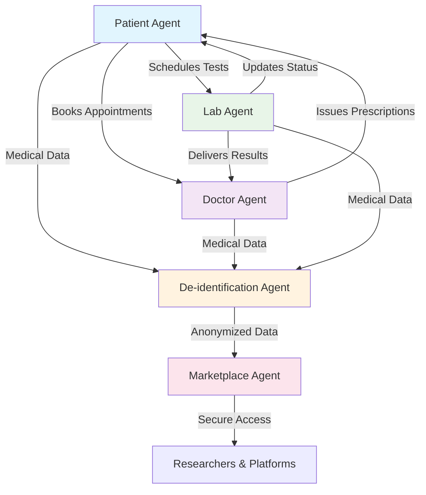

# 🏥 CareCrypt  

**Secure. Smart. Patient-Centric.**  
A decentralized healthcare ecosystem built on **Fetch.ai and Ethereum**, automating care workflows while enabling privacy-preserving medical data research.

---

## 🔍 The Problem  

Healthcare today suffers from:
- **Fragmented workflows** — scattered appointments, manual coordination, and communication delays
- **Underutilized patient data** — valuable health records remain siloed due to privacy concerns, limiting medical research

---

## 💡 Our Solution  

CareCrypt leverages **Fetch.ai's uAgents framework**, **ASI-powered de-identification**, and **Ethereum's x402 protocol** to create a unified healthcare ecosystem that:

✅ **Automates** appointments, prescriptions, and lab workflows  
✅ **De-identifies** medical data using ASI and Presidio for HIPAA compliance  
✅ **Enables** secure, traceable payments for dataset access  
✅ **Delivers** privacy-preserving datasets to researchers  

---

## 🤖 Autonomous Agent Network  

### 🧑‍⚕️ Patient Agent  
**Your healthcare navigator**
- Symptom assessment using SingularityNET knowledge graphs
- Automated appointment booking
- Seamless care coordination
- *Address: `agent1qveeyurxp6g3wuuacpm3f5mhjn74mg280eqskkt9tpdpsxx24c8rk32nqru`*

### 👨‍⚕️ Doctor Agent  
**Clinical workflow automation**
- Intelligent scheduling management
- Digital prescription issuance
- Patient-lab coordination
- *Address: `agent1qdnhgml8q77qluk98gezsuq65h68e5swfws8hts7686cca3psej8wfw9j94`*

### 🔬 Lab Agent  
**Laboratory operations**
- Test appointment scheduling
- Secure result delivery
- Real-time status updates
- *Address: `agent1qvw20wl8v6g0zxae6pcd8qeufzd3u0ehmvt6dzuqtmm7xj60qtpacfuhypy`*

### 🛡️ De-identification Agent
**Privacy protection**
- ASI-powered data anonymization
- HIPAA compliance enforcement
- Medical data preparation for research
- *Address: `agent1qtr3a8fmq5slh0w0ju38ptrrzqzqr3xrrcjj2jkmfc62jlde4vmkcvxyx2d`*

### 💰 Marketplace Agent 
**Data monetization**
- Secure dataset access control
- x402 protocol payment processing
- Research platform integration
- *Address: `agent1qv6k5kj9535a3yaxuy2zlzk2z2jl844mvneej2mrdmzs82kup3czcdp0vp7`*

---

## 🏗️ System Architecture



---

## 🛠️ Technology Stack

| **Component** | **Technology** | **Purpose** |
|---------------|----------------|-------------|
| **Agent Framework** | Fetch.ai uAgents | Autonomous agent orchestration |
| **AI Processing** | ASI (SingularityNET) | Intelligent de-identification |
| **Payment Layer** | Ethereum x402 | Secure transactions & access control |
| **Data Storage** | Supabase | Scalable backend infrastructure |

---

## 🌟 Impact & Benefits

**For Patients**  
Streamlined care navigation with automated scheduling and real-time updates

**For Healthcare Providers**  
Unified workflows, reduced administrative overhead, and improved coordination

**For Researchers**  
Access to privacy-compliant datasets enabling medical breakthroughs

**For the Ecosystem**  
Transformation of health records into secure, research-ready digital assets

---

## 🚀 Getting Started

```bash
# Clone the repository
git clone https://github.com/yourusername/carecrypt
cd carecrypt

# Install dependencies
pip install -r requirements.txt

# Configure your agents
# 1. Update the seed phrase in each agent file for unique addresses
# 2. Configure your Fetch.ai wallet and API keys in .env

# Start each agent individually
python patient_agent.py
python doctor_agent.py  
python lab_agent.py
python deidentification_agent.py
python marketplace_agent.py

# Run the main server (in a separate terminal)
python server.py
```

**Note**: Each agent runs independently. Start them in separate terminal windows for optimal performance.

---

## 📈 Project Status

**Current Phase**: Prototype / Proof-of-Concept  
**Built For**: ETH Hackathon (ASI Track, Fetch.ai Ecosystem)  
**Next Steps**: Production deployment and ecosystem expansion

---

## 🤝 Contributing

We welcome contributions! Please follow these steps:

1. Fork the repository
2. Create your feature branch (`git checkout -b feature/amazing-feature`)
3. Commit your changes (`git commit -m 'Add amazing feature'`)
4. Push to the branch (`git push origin feature/amazing-feature`)
5. Open a Pull Request

---

## 📄 License

This project is licensed under the MIT License. See [LICENSE](LICENSE) for details.

---

## 📬 Contact

Questions or collaboration opportunities? Reach out via [GitHub Issues](../../issues) or connect with our team.