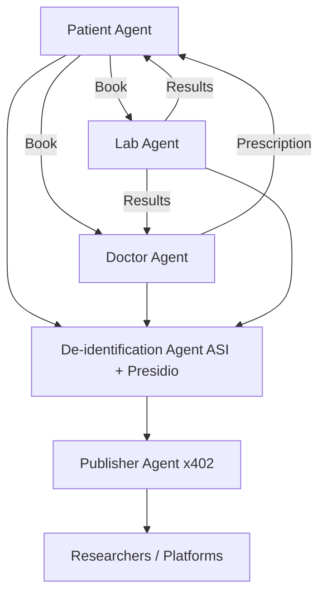

# 🏥 CareCrypt  

**Secure. Smart. Patient-Centric.**  
A decentralized healthcare ecosystem built on **Fetch.ai and Ethereum**, automating care workflows while unlocking privacy-preserving medical data.  

---

## 🔍 Problem & Motivation  

Healthcare today faces two big challenges:  
1. **Inefficient appointments & communication** — delays, scattered lab bookings, and manual coordination frustrate patients and providers.  
2. **Underutilized patient data** — health records remain siloed, with little value unlocked for research due to privacy concerns.  

---

## 💡 Solution Overview  

CareCrypt leverages **Fetch.ai's uAgents framework**, **ASI for de-identification**, and **Ethereum (x402 protocol)** to:  

- Automate **appointments, prescriptions, and lab workflows**.  
- Apply **ASI-powered de-identification (with Presidio)** to remove sensitive identifiers and make medical data research-ready.  
- Enable **secure, traceable payments** for dataset access via **x402**.  
- Deliver **anonymized datasets** to researchers and healthcare platforms without compromising privacy.  

---

## 🤖 Agents & System Flow  

CareCrypt is powered by **five autonomous agents**:  

### 1. 🧑‍⚕️ Patient Agent  
- First contact point for patients.  
- Uses a **knowledge graph** to answer symptom queries.  
- Books doctor appointments or lab tests.  
- Provides a guided, frustration-free patient journey.  

### 2. 👨‍💼 Doctor Agent  
- Manages **scheduling** and **prescription issuance**.  
- Syncs with patients and labs for coordination.  
- Automates routine workflows for efficiency.  

### 3. 🔬 Lab Agent  
- Books and manages **lab test appointments**.  
- Securely delivers **results via Fetch.ai network**.  
- Keeps both doctors and patients updated, ensuring a closed-loop workflow.  

### 4. 🛡 De-identification Agent  
- Uses **ASI + Presidio** to strip sensitive identifiers.  
- Ensures **HIPAA compliance** while retaining research value.  
- Stores cleaned data in a secure backend.  

### 5. 💰 Publisher Agent  
- Manages **data access, authorization, and payments**.  
- Uses **x402 protocol** for secure, auditable transactions.  
- Provides researchers with **traceable, anonymized datasets**.  

---

## 🏗 Architecture Diagram

---

## 🛠 Tech Stack

| Technology | Purpose |
|------------|---------|
| **Fetch.ai uAgents** | Autonomous agent framework |
| **Presidio** | HIPAA identifier removal |
| **ASI (SingularityNET)** | De-identification AI processing |
| **Ethereum (x402 protocol)** | Secure payments & access control |
| **Supabase** | Backend storage |

---

## 🌍 Impact

* **Patients**: Frustration-free, faster care navigation
* **Doctors & Labs**: Unified scheduling, automated workflows  
* **Researchers**: Privacy-preserving datasets for innovation
* **Ecosystem**: Health records become secure, research-ready assets

---

## 🛤 Roadmap

* ✅ Core agents (Patient, Doctor, Lab, De-identification, Publisher)
* ✅ Payments via x402
* 🔄 Monetization layer for patients/doctors (future)
* 🔄 Telemedicine support in Doctor Agent (future)
* 🔄 Expanded data marketplace (future)

---

## 📦 Project Status

**Current**: Prototype / Proof-of-Concept  
**Built for**: ETH Hackathon (ASI Track, Fetch.ai ecosystem)

---

## 🚀 Getting Started

1. Clone the repository
2. Install dependencies: `npm install`
3. Configure your Fetch.ai wallet and API keys
4. Run the agent network: `npm start`

---

## 🤝 Contributing

1. Fork the repository
2. Create a feature branch (`git checkout -b feature/amazing-feature`)
3. Commit your changes (`git commit -m 'Add amazing feature'`)
4. Push to the branch (`git push origin feature/amazing-feature`)
5. Open a Pull Request

---

## 📜 License

This project is licensed under the MIT License - see the [LICENSE](LICENSE) file for details.

---

## 📞 Contact

For questions or collaboration opportunities, reach out via [GitHub Issues](../../issues).